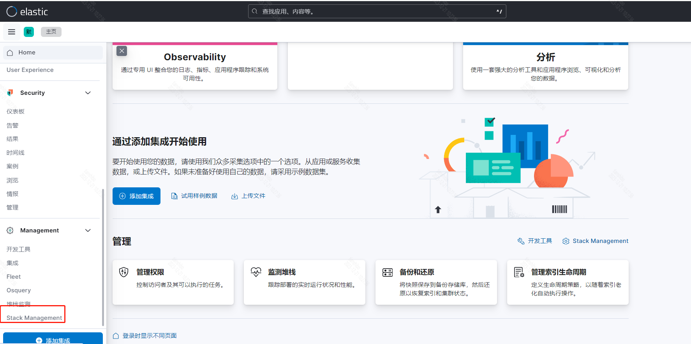
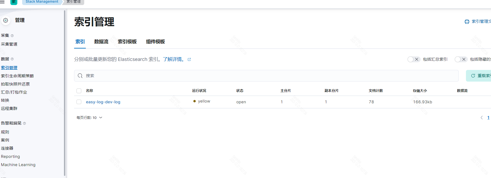
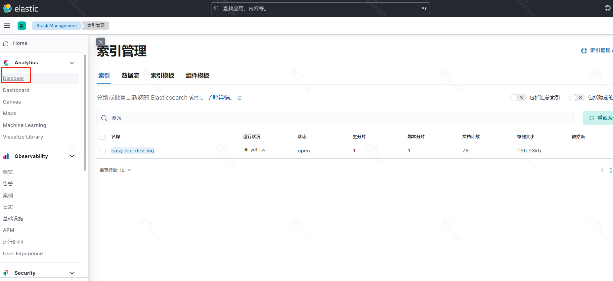
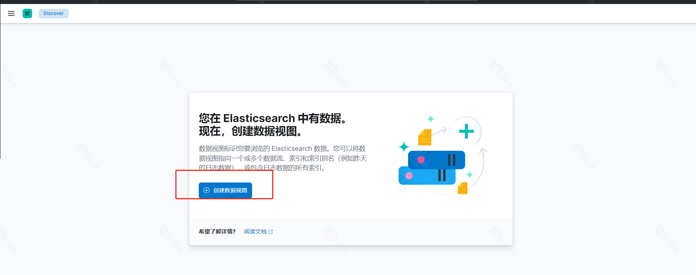
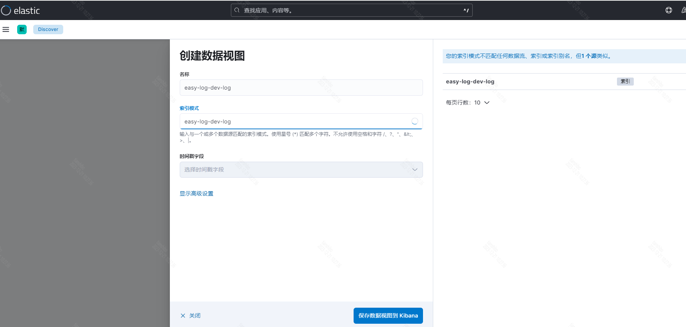
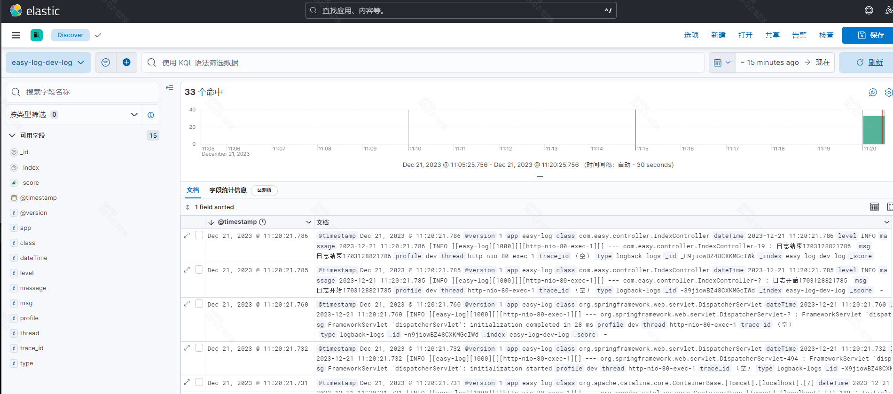
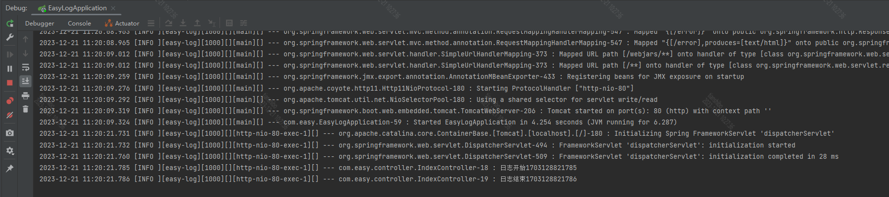
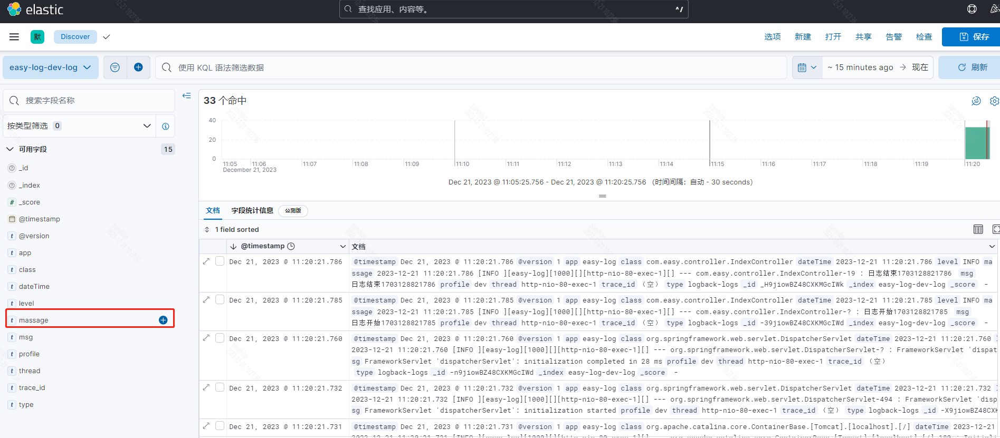
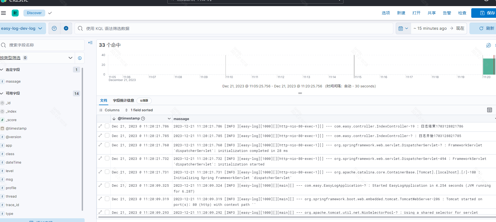

# 项目介绍
ELK+SpringBoot搭建日志分析系统
## 简介
一个日志收集demo
elasticsearch+logstash+kibana
Elasticsearch会集中存储您的数据，让您飞快完成搜索，并对数据进行强大的分析。
Logstash 是免费且开放的服务器端数据处理管道，能够从多个来源采集数据，转换数据，然后将数据发送到数据库中。
Kibana 是一个免费且开放的用户界面，能够让您对 Elasticsearch 数据进行可视化，从跟踪查询负载，到查看应用请求的整个过程，都能轻松完成。
## 工程介绍
easy-log web服务,旨在测试日志记录效果

## 搭建步骤

### 搭建平台版本
|  平台   | 版本  |
|  ----  | ----  |
| linux  | centos stream 9 |
| java  | openjdk 17 |
| elasticsearch  | 8.6.2 |
| logstash  | 8.6.2 |
| kibana  | 8.6.2 |
| VMware Workstation Pro  | 17 |

### 搭建步骤  (项目所需服务均使用Docker进行安装)
#### docker目录创建: (作者在/home 目录下操作)
    mkdir elasticsearch
    mkdir kibana
    mkdir logstash
####   ELK安装与启动：

##### elasticsearch
    容器创建:
    docker run \
    --name elasticsearch \
    -p 9200:9200 -p 9300:9300 \
    -e  "discovery.type=single-node" \
    -e ES_JAVA_OPTS="-Xms64m -Xmx2048m" \
    -d elasticsearch:8.6.2

    将容器内的配置文件拷贝到本地: 

    docker cp elasticsearch:/usr/share/elasticsearch/config/elasticsearch.yml /home/elasticsearch/config/elasticsearch.yml
    docker cp elasticsearch:/usr/share/elasticsearch/data /home/elasticsearch/data
    docker cp elasticsearch:/usr/share/elasticsearch/plugins /home/elasticsearch/plugins

    删除原来容器:
    docker rm -f elasticsearch
    
    容器创建: (挂载目录方式启动,后方便修改容器服务配置)
    docker run \
    --name elasticsearch \
    --privileged=true \
    -p 9200:9200 -p 9300:9300 \
    -e  "discovery.type=single-node" \
    -e ES_JAVA_OPTS="-Xms64m -Xmx2048m" \
    -v /home/elasticsearch/config/elasticsearch.yml:/usr/share/elasticsearch/config/elasticsearch.yml \
    -v /home/elasticsearch/data:/usr/share/elasticsearch/data \
    -v /home/elasticsearch/plugins:/usr/share/elasticsearch/plugins \
    -d elasticsearch:8.6.2
    
    服务启动:
    docker start elasticsearch

#####   kibana
     容器创建: (使用汉化 "I18N_LOCALE=zh-CN")
    docker run
    --name kibana \
    -e "I18N_LOCALE=zh-CN" \
    -p 5601:5601 \
    -v /home/kibana/config:/usr/share/kibana/config \
    -d kibana:8.6.2

    将容器内的配置文件拷贝到本地:
    docker cp kibana:/usr/share/kibana/config /home/kibana/config

    进入/home/kibana/config目录，修改kibana.yml配置文件,
    将elasticsearch.hosts的配置修改为elasticsearch地址:

    # Default Kibana configuration for docker target
    server.host: "0"
    server.shutdownTimeout: "5s"
    # 配置elasticsearch地址,如果是部署在本地,不能使用localhost,一定要配置ip,否则连接失败
    elasticsearch.hosts: [ "http://192.168.42.128:9200" ]
    monitoring.ui.container.elasticsearch.enabled: true

    删除原来容器:
    docker rm -f kibana
    
    容器创建:
    docker run 
    --name kibana \
    -p 5601:5601 \
    --privileged=true \
    -v /home/kibana/config:/usr/share/kibana/config \
    -d kibana:8.6.2

    服务启动:
    docker start kibana

##### 待启动成功后，在浏览器中输入http://ip:5601/

#### logstash
    容器创建:
    docker run \
    --name logstash \
    --privileged=true \
    -p 5044:5044 \
    -p 9400:9400 \
    -d logstash:8.6.2

    将容器内的配置文件拷贝到本地:
    docker cp logstash:/usr/share/logstash/config/ /home/logstash/config
    docker cp logstash:/usr/share/logstash/pipeline /home/logstash/pipeline
    docker cp logstash:/usr/share/logstash/data /home/logstash/data

    进入/home/logstash/config目录，修改logstash.yml配置文件:

    ----------------------------------------------
    node.name: logstash-203
    http.host: "0.0.0.0"
    xpack.monitoring.elasticsearch.hosts: [ "http://192.168.42.128:9200" ]
    # 日志格式 json/plain
    log.format: json
    # 日志文件目录配置
    path.logs: /usr/share/logstash/logs
    ----------------------------------------------

    修改pipelines.yml配置文件
    这个配置文件主要是配置输入、过滤和输出，这些部分均会由 Logstash 管道予以执行:

    ----------------------------------------------
    - pipeline.id: main
      # 该配置会读取pipeline目录下所有的conf文件
      path.config: "/usr/share/logstash/pipeline/*.conf"
    ----------------------------------------------
    删除原来容器:
    docker rm -f logstash
    
    容器创建: 
    docker run \
    --name logstash \
    --privileged=true \
    -p 5044:5044 \
    -p 9400:9400 \
    -v /home/logstash/config/:/usr/share/logstash/config \
    -v /home/logstash/pipeline:/usr/share/logstash/pipeline \
    -v /home/logstash/data:/usr/share/logstash/data \
    -d logstash:8.6.2

    创建配置文件,在/home/logstash/pipeline目录下创建logstash.conf文件
    ----------------------------------------------
    input {
        beats {
            port => 5044
        }
    }
    output {
        stdout {
            codec => rubydebug
        }
        elasticsearch {
            action => "index"
            # 这里是es的地址，多个es要写成数组的形式
            hosts  => "192.168.42.128:9200"
            # 索引采用服务app名称加环境profile
            index  => "%{app}-%{profile}-log"
            # 超时时间
            timeout => 300
        }
    }
    ----------------------------------------------
    服务启动:
    docker start logstash

### Springboot整合 
#### 依赖    
    <dependency>
        <groupId>ch.qos.logback</groupId>
        <artifactId>logback-classic</artifactId>
    </dependency>
    <dependency>
        <groupId>net.logstash.logback</groupId>
        <artifactId>logstash-logback-encoder</artifactId>
        <version>7.3</version>
    </dependency>
#### resource目录下创建logback-spring.xml文件
    <?xml version="1.0" encoding="UTF-8"?>
    <configuration scan="true" scanPeriod="60 seconds">

    <contextName>logback</contextName>
    <!--从SpringBoot配置文件读取项目名，环境，以及logstash地址-->
    <springProperty scope="context" name="springAppName" source="spring.application.name"/>
    <springProperty scope="context" name="springProfile" source="spring.profiles.active"/>
    <springProperty scope="context" name="logstashAddress" source="logging.logstash.address"/>

    <!--格式化输出：%d:表示日期  %thread:表示线程名  %-5level:级别从左显示5个字符宽度  %msg:日志消息   %n:是换行符-->
    <property name="logPattern"
              value="%d{yyyy-MM-dd HH:mm:ss.SSS} [%-5p][${springAppName:-}][${PID:- }][%X{X-TraceId:-}][%t][%X{domain:-}] --- %logger-%line : %msg %n" />

    <!--输出到控制台-->
    <appender name="console" class="ch.qos.logback.core.ConsoleAppender">
        <filter class="ch.qos.logback.classic.filter.ThresholdFilter">
            <level>INFO</level>
        </filter>
        <withJansi>false</withJansi>
        <encoder>
            <pattern>${logPattern}</pattern>
            <charset>UTF-8</charset>
        </encoder>
    </appender>

    <!--配置INFO输出到logstah-->
    <appender name="LOGSTASH_INFO" class="net.logstash.logback.appender.LogstashTcpSocketAppender">
        <!--配置logstash地址-->
        <destination>${logstashAddress}</destination>
        <!--日志文件输出格式-->
        <encoder class="net.logstash.logback.encoder.LoggingEventCompositeJsonEncoder">
            <providers>
                <pattern>
                    <pattern>
                        {
                        <!--设置项目-->
                        "app": "${springAppName:-}",
                        <!--设置环境-->
                        "profile": "${springProfile:-}",
                        <!--设置等级-->
                        "level": "%level",
                        <!--设置traceId-->
                        "trace_id": "%X{X-TraceId:-}",
                        <!--设置thread-->
                        "thread": "%t",
                        <!--设置类名-->
                        "class": "%c",
                        <!--设置消息-->
                        "msg": "%msg",
                        <!--设置输出日期-->
                        "dateTime": "%date{yyyy-MM-dd HH:mm:ss.SSS}",
                        <!--设置消息体-->
                        "massage": "%d{yyyy-MM-dd HH:mm:ss.SSS} [%-5p][${springAppName:-}][${PID:- }][%X{X-TraceId:-}][%t][%X{domain:-}] --- %logger-%line : %msg %n"
                        }
                    </pattern>
                </pattern>
            </providers>
        </encoder>
    </appender>

    <root level="info">
        <appender-ref ref="LOGSTASH_INFO"/>
        <appender-ref ref="console"/>
    </root>

    </configuration>
#### application.yml
    spring:
        application:
            # 日志索引用到app    
            name: easy-log
    profiles:
        # 日志索引用到profile
        active: dev
    server:
        port: 80
    logging:
        # 日志文件地址
        config: classpath:logback-spring.xml
        # 配置Logstash地址
        logstash:
            address: 192.168.42.128:9400
        level:
            root: info
#### 启动项目
    找到侧边导航栏  Stack Management

    点开后找到索引管理 可以看到本服务日志 easy-log-dev-log 

    回到侧边栏到Discover

    创建数据视图

    将右侧存在索引复制到输入框后保存

调用测试接口 http://localhost/easy/log/myTestInfo

    添加字段massage展示消息体

    与控制台日志匹配测试

#### 备注

